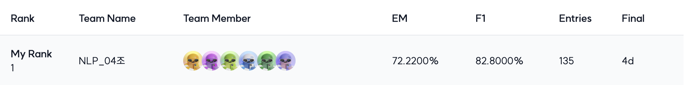

# ODQA(Open-Domain Question Answering Competition)

## 개요

| 항목 | 내용 |
| --- | --- |
| 프로젝트 주제 | MRC(기계독해) 데이터셋으로 ODQA(Open-Domain Question Answering)를 수행합니다. <br>RAG(Retrieval-Augmented Generation)로 더 많이 알려져 있습니다. |
| 프로젝트 구성 | 질문에 관련된 문서를 찾는 Retriever와 찾아온 문서에서 질문에 대한 정답을 찾는 Reader로 구성됩니다. |
| 평가 지표 | Exact Match (EM) Score를 사용하여 모델의 예측과, 실제 답이 정확하게 일치할 때만 점수가 주어집니다. <br>F1 Score는 참고용으로만 활용됩니다. |
| 진행 기간 |  2024년 10월 2일 ~ 2024년 10월 24일 |

## 최종 리더보드 (Private)


## 팀원

|[이예서](https://github.com/yeseoLee)|[김수진](https://github.com/Sujinkim-625)|[김민서](https://github.com/luckyvickyricky)|[홍성재](https://github.com/koreannn)|[양가연](https://github.com/gayeon7877)|[홍성민](https://github.com/hsmin9809)|
|:-:|:-:|:-:|:-:|:-:|:-:|
|<a href="https://github.com/yeseoLee"></a>|<a href="https://github.com/Sujinkim-625"></a>|<a href="https://github.com/luckyvickyricky"></a>|<a href="https://github.com/koreannn"></a>|<a href="https://github.com/gayeon7877"></a>|<a href="https://github.com/hsmin9809"></a>|

## 역할

| 이름 | 역할 |
| --- | --- |
| 김민서 | 데이터분석, LLM기반 데이터 증강, 모델실험(증강 데이터 비교), 앙상블 |
| 김수진 | 외부데이터 리서치 및 학습, 데이터 전처리, 모델 리서치, 모델 개선, 모델 실험, <br>Retrieval 구현 및 실험(ColBERT), 앙상블 |
| 양가연 | Retrieval(BM25) 구현 및 실험, 모델 리서치, 모델 개선(Custom Layer, Distillation), <br>모델 실험, 앙상블(hard ensemble, soft ensemble, weighted ensemble) |
| 이예서 | PM(마일스톤 및 이슈 관리), 인프라 담당(개발환경 구성 스크립트화), <br>베이스라인 코드 템플릿화, 데이터 전처리(cleansing), 데이터 증강(negative passage), <br>Retrieval 구현 및 실험(Elasticsearch, Reranking), 앙상블 (merged ensemble) |
| 홍성민 | 모델 리서치, 모델 실험, Retrieval 구현 및 실험(Dense), 앙상블 |
| 홍성재 | EDA, 데이터 전처리, Reader성능 개선 관련 조사(Retrospective Reader), 앙상블 |

## Wrap-Up Report
### [MRC_NLP_리포트(04조).pdf](./assets/MRC_NLP_04_report.pdf)  
데이터 EDA부터 앙상블까지 프로젝트 전반의 시행착오와 솔루션 및 회고는 렙업 리포트를 통해 확인할 수 있습니다.

## 폴더 구조
```bash
level2-mrc-nlp-04
├── code
│   ├── BertEncoder.py
│   ├── README.MD
│   ├── arguments.py
│   ├── config
│   │   ├── elastic_setting.json
│   │   ├── eval.json
│   │   ├── inference.json
│   │   ├── inference_with_rerank.json
│   │   ├── integration.json
│   │   └── train.json
│   ├── custom_model.py
│   ├── dense_train.py
│   ├── inference.py
│   ├── integration_pipeline.py
│   ├── retrieval
│   │   ├── __init__.py
│   │   ├── base.py
│   │   ├── bm25.py
│   │   ├── dense.py
│   │   ├── dense_encoder
│   │   ├── elastic.py
│   │   ├── reranker.py
│   │   └── tdidf.py
│   ├── train.py
│   └── utils
│       ├── __init__.py
│       ├── trainer_qa.py
│       └── utils_qa.py
├── data
├── ensemble
│   ├── gpt_voting.ipynb
│   ├── hard_voting.py
│   ├── results_hard
│   ├── results_soft
│   └── soft_voting.py
├── external_dataset_processing
│   ├── arrow_to_csv.py
│   ├── csv_to_arrow.py
│   ├── find_answer_start.py
│   └── train_for_training.py
├── notebooks
│   ├── EDA_train,test.ipynb
│   ├── EDA_wiki.ipynb
│   ├── add_question_augmentation_GPT.ipynb
│   ├── analyze_test_difficulty.ipynb
│   ├── data_info1.png
│   ├── dense_top-k_confirm.ipynb
│   ├── eda_for_data_cleaning.ipynb
│   ├── elasticsearch.ipynb
│   ├── question_classification_GPT.ipynb
│   ├── retriever_base_dataset.ipynb
│   ├── retriever_evaluation.ipynb
│   ├── shuffle_data.ipynb
│   └── synonym_questions_augmentation_GPT.ipynb
└── setup
    ├── requirements.txt
    ├── setup-elasticsearch.bash
    ├── setup-git.bash
    └── setup-gpu-server.bash
```

- code: 학습 및 추론에 사용되는 코드 전반을 관리합니다.
- data: 학습 및 추론에 필요한 데이터를 관리합니다.
- ensemble: 추론 결과 파일을 이용한 앙상블을 수행하는 코드를 관리합니다.
- external_dataset_processing: 외부 데이터셋 사용을 위한 전처리 코드를 관리합니다.
- notebooks: 데이터 분석 및 전처리, 증강 방법 소개와 구현 코드 사용법 안내 등의 주피터 노트북 파일을 관리합니다.
- setup: GPU 서버 개발 환경 세팅을 위한 스크립트를 관리합니다.

## Dependencies
```angular2html
# Data manipulation and analysis
pandas
numpy==1.24.1

# Machine Learning libraries
scikit-learn
torch==1.13
datasets==2.15.0
transformers==4.25.1
faiss-gpu

# Progress and logging utilities
tqdm
wandb

# Information retrieval libraries
rank_bm25
elasticsearch
```

## Usage
1. Settings
```angular2html
pip install -r setup/requirements.txt
```
2. Train & Inference   
[학습 및 추론 코드 사용 방법](code/README.MD)  
